# Redux workshop - Spotify client

Today's workshop will see us build an application using _real data_ from the Spotify API.

Here is what the _final product_ will look like:


This is an application designed for _mobile browsers_. It loads data in real-time from the Spotify API, and stores this data in Redux.

This screenshot may not look like a lot of work, but getting everything set up can be quite challenging!

## Working with APIs

There are many third-party APIs that let us build rich applications on top of them:

- You can use the Google Maps API to embed a live map on your site
- You can use the Instagram API to display photos from Instagram
- You can use various sports APIs to build analytics apps based on sports data.

The way that they typically work is they expose a set of "RESTful endpoints".

The trickiest part of working with third-party APIs is _authentication_. APIs don't want strangers to abuse their services, so they require that you register for a _key_ and use that key on all requests.

First order of business is registering for a Spotify API key.

### Registering an API key

First, you'll need a Spotify account. If you don't already have one, you can create one for free at this URL: https://www.spotify.com/signup

After you have an account, navigate to the Dashboard login screen: https://developer.spotify.com/dashboard/login. Log in with your new account.

The very first time you do this, you'll need to agree to the terms of service.

We need to create an "app". Essentially, we need to tell Spotify what we want to do with its API. In return, it will give us some API keys we can use.

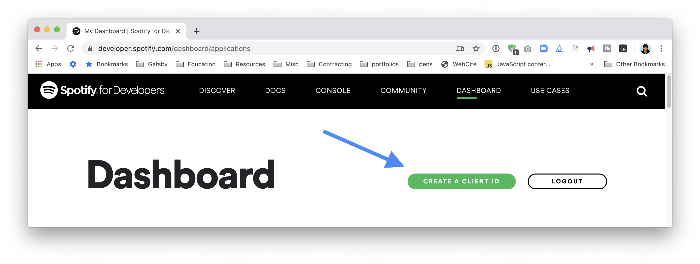

Enter something like the following:

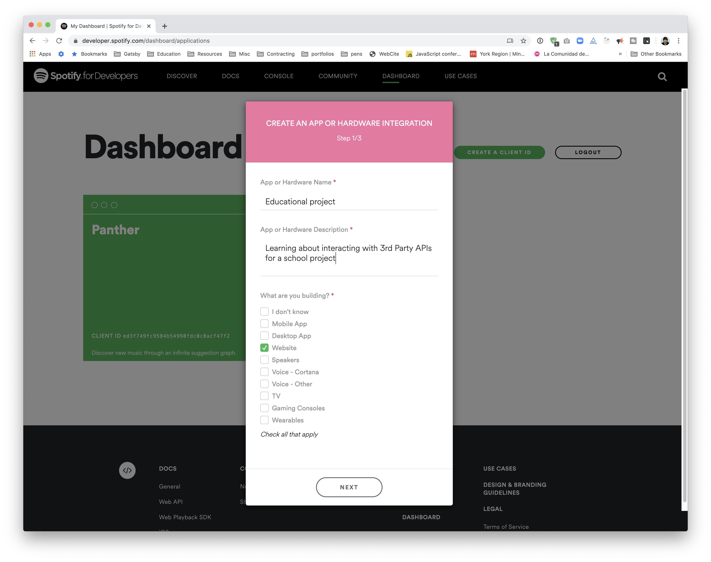

You'll be asked if this is a commercial or non-commercial application. Select **non-commercial**.

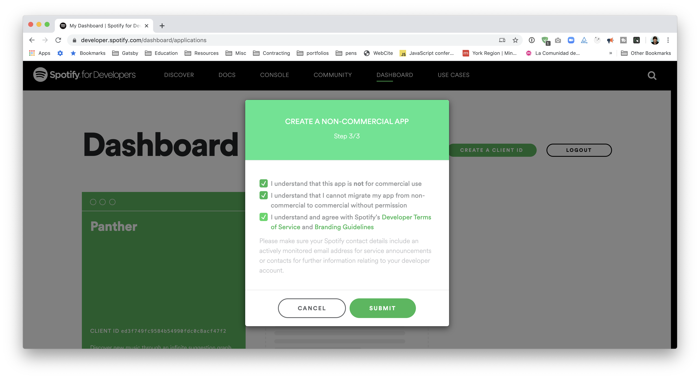

Afterwards, you should be taken to the app's home screen. This page will give us our Client ID and our Secret (we'll need to click "Show client secret" to reveal it):

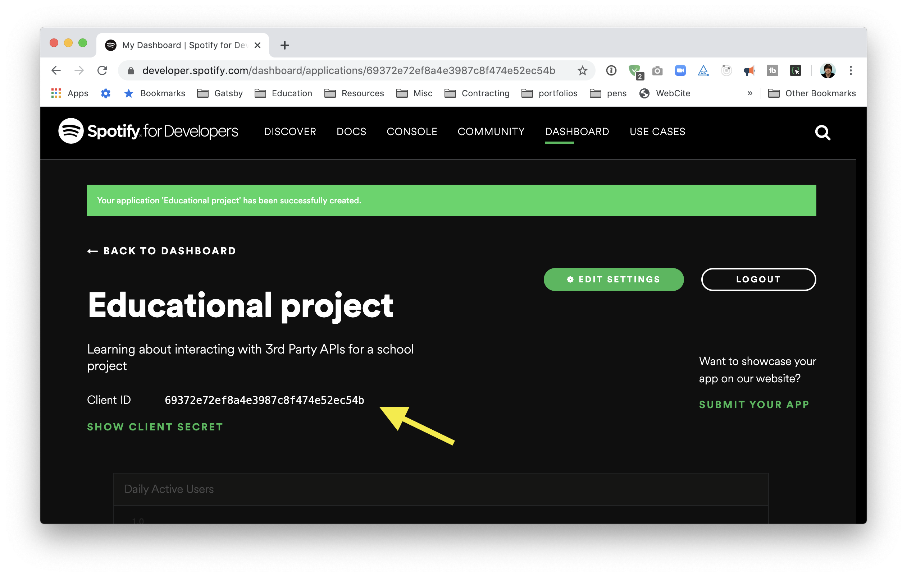

### Storing keys

Duplicate the `.env.example` in the root `workshop` directory, and then rename it `.env`. Copy and paste your `KEY` and `SECRET` it the `.env` file:

Replace "YOUR_KEY_HERE" with the keys provided from Spotify

```
SPOTIFY_CLIENT_ID=YOUR_KEY_HERE
SPOTIFY_SECRET=YOUR_KEY_HERE
```

### Avoiding source control

🚨 **It is very important** that you not commit this `.env` file into git - otherwise, it will show up on Github. Bad actors run scripts that search Github for exposed private keys. If they find yours, they'll use it for nefarious purposes, and you'll get banned from using the Spotify API.

You can tell git not to track certain files in the `.gitignore`.

If you open `workshop/.gitignore`, it should include this:

```
// Lots of stuff omitted

# misc
.DS_Store
.env
.env.local
.env.development.local
.env.test.local
.env.production.local
```

Because we've already added `.env` to this file, git won't try and commit it. No action is needed on your part, **but it's important to be mindful of this on other projects.** Always add your "secrets" to gitignore.

## Understanding the initial state of the workshop

Inside `/workshop`, you'll see that we have a typical boilerplate setup for a React application.

We also have a `server` folder.

We need a Node server for 1 very specific reason: to generate access tokens for the Spotify API.

Here's how authentication works:

1. You sign up for a Client ID and API secret from Spotify (✔ we did this already)
2. Whenever the user loads our app, we'll want to use the Client ID and API secret to generate an "access token".
3. We'll use that access token to prove to Spotify that we are allowed to access certain resources.

> _Why can't we send the API secret directly to Spotify?_ It might be confusing why we have to do this big dance. Why can't we use the API secret directly with Spotify?
>
> This is a security precaution. We cannot store the API Secret on the client, because nothing is secret on the client. The server can hold secret data, so it owns the API Secret, but the client at no point knows what the secret is. Bad actors (hackers) will have a much more difficult time accessing our secret on the server.
>
> The client is aware of the _access token_. An access token has a very short lifespan: it only lasts 1 hour. So if a bad actor is somehow able to procure an access token, they won't be able to take much advantage of it.

## Running

You can run both the client and the server by running `yarn start` inside the `workshop` directory.

The design for this project lives on Figma. You can access it here:
https://www.figma.com/file/VAYO9Ezmxx4fMR29Sgylck/Spotify-App

(You'll need to create a free account to be able to interact with the design.)

## Setup

We have a few small tasks to do to finish setting up the initial project.

### Add Google Fonts

This project uses Montserrat, font weights 400, 600, and 800.

Go to https://fonts.google.com/ and get an embed snippet for this font. Add it to your page.

_HINT:_ should be a `<link>` tag. You'll want to copy/paste the snippet they give you into `public/index.html`

### Set up the proxy

We have a server-side component, and we need to proxy requests on the front-end.

Add this line to your `package.json`:

```
"proxy": "http://localhost:5678",
```

### CSS Reset

Create a new component, `GlobalStyles`, and add in some global styles using styled-components `createGlobalStyles`.

Up to you exactly what you'd like to add, but it's recommended that you add at least this:

```css
html,
body,
div,
span {
  margin: 0;
  padding: 0;
  border: 0;
  vertical-align: baseline;
}

/* GLOBAL STYLES */
*,
*:before,
*:after {
  box-sizing: border-box;
  -webkit-font-smoothing: antialiased;
  font-family: Montserrat, sans-serif;
}
```

Render the `GlobalStyles` component in `src/App`.

## Exercise 1 – Server setup

We have a Node server that exists to connect to Spotify and produce an access token for the client.

If you open `server/server.js`, you'll see that we have an express endpoint, `app.get('/spotify_access_token')`. We'll want to hit this endpoint from our client.

For now, let's test using Insomnia. The server runs on port 5678, so you can make a GET request to `localhost:5678/spotify_access_token`. For now, you should get the following response:

```
{ todo: true }
```

As a stretch, see if you can work out how to complete this endpoint, given the following pieces of information:

1. Spotify's documentation can be found here: https://developer.spotify.com/documentation/general/guides/authorization-guide/#client-credentials-flow

- Be sure to read the instructions for "Client Credentials flow". Ignore the other flows

2. You can use `isomorphic-fetch`, an NPM package installed to this project, to use the familiar `fetch` API in Node.js. Import the package, and you'll be able to use fetch normally:

- `const fetch = require('isomorphic-fetch')`

3. You'll want to send the following headers:

```
{
  'Authorization': `Basic ${authString}`,
  'Content-Type': 'application/x-www-form-urlencoded',
};
```

We have given you the `authString` already, which uses a trick called "Base64 Encoding" to mask the secret. You are not expected to know anything about this line; you can research it if curious, but it is sufficient to know that it's a required transformation for security purposes.

Spend between 5-10 minutes seeing if you can combine these pieces into an endpoint that returns the access token when you make a request to the server with Insomnia.

.
..
...
....
.....
......
.......
........
.......
......
.....
....
...
..
.
..
...
....
.....
......
.......
........
.......
......
.....
....
...
..
.
..
...
....
.....
......
.......
........

Here's what your endpoint should look like:

```js
app.get('/spotify_access_token', async (req, res, next) => {
  const clientId = process.env.SPOTIFY_CLIENT_ID;
  const clientSecret = process.env.SPOTIFY_SECRET;

  // We need, annoyingly, a base64-encoded string of our id:secret, for spotify.
  // We can use Buffers to do this for us.
  const authString = Buffer.from(clientId + ':' + clientSecret).toString(
    'base64'
  );

  const response = await fetch('https://accounts.spotify.com/api/token', {
    method: 'POST',
    headers: {
      Authorization: `Basic ${authString}`,
      'Content-Type': 'application/x-www-form-urlencoded',
    },
    body: 'grant_type=client_credentials',
  });

  const json = await response.json();

  return res.send(json);
});
```

All of this information was gleaned from the Spotify API documentation linked above (https://developer.spotify.com/documentation/general/guides/authorization-guide/#client-credentials-flow).

---

## Exercise 2 - Frontend plumbing

We need to set up Redux!

Create a few new files:

- `src/reducers/index.js`
- `src/store.js`
- `src/actions.js`

For this workshop, here are the types of data we'll be dealing with:

- We need to hit our server to get an API key
- We need to hit Spotify's API to get artist information

These fall into two broad categories: `auth` and `artists`. Here's a depiction of what our state will look like:

```js
{
  auth: {
    token: 'abc123',
    status: 'idle',
  },
  artists: {
    currentArtist: /* Data from Spotify API */,
    status: 'idle',
  }
}
```

Inside `src/reducers/index.js`, add the following code:

```js
import { combineReducers } from 'redux';

import auth from './auth-reducer';
import artists from './artists-reducer';

export default combineReducers({ auth, artists });
```

Create the two files mentioned, `auth-reducer` and `artists-reducer`. We'll want to create the "minimum viable reducer" for now.

Here's what `auth-reducer` looks like:

```js
const initialState = {
  token: null,
  status: 'idle',
};

export default function authReducer(state = initialState, action) {
  switch (action.type) {
    default: {
      return state;
    }
  }
}
```

Follow the same pattern for `artist-reducer.js`

- The initial state for `artist-reducer`.

Inside `store.js`, we'll do our typical Redux store boilerplate:

> REMEMBER: Lead a healthy lifestyle, don't eat the copy pasta!

```js
import { createStore } from 'redux';

import reducer from './reducers';

export default function configureStore(initialState) {
  const store = createStore(
    reducer,
    initialState,
    window.__REDUX_DEVTOOLS_EXTENSION__ && window.__REDUX_DEVTOOLS_EXTENSION__()
  );

  return store;
}
```

> This looks slightly different from last time! Instead of doing the store-creation inside `src/index.js`, we're doing it in `store.js` and exporting a function to create a store.
>
> This is a more common practice on larger applications.

Inside your main index file, let's finish up the Redux boilerplate by importing the `Provider`, and passing it a new store:

```diff
import React from 'react';
import ReactDOM from 'react-dom';
+import { Provider } from 'react-redux';

+import configureStore from './store';

import App from './components/App';

+const store = configureStore();

ReactDOM.render(
- <App />,
+ <Provider store={store}>
+   <App />
+ </Provider>,
  document.getElementById('root')
);
```

---

## Exercise 3: Routing

Our application is only going to have one route: `/artists/:id`. We'll take the artist ID from the URL and send it to Spotify to fetch all the data we need.

What if the user goes to the home route, `localhost:3000/`? We can use `Redirect` to send them to a "placeholder" artist (the artist it starts on).

You'll need the Spotify ID for a musician you like. You can figure this out by googling "spotify [artist name]". The first search result should be the Spotify artist page. The artist's Spotify ID can be found in the URL:

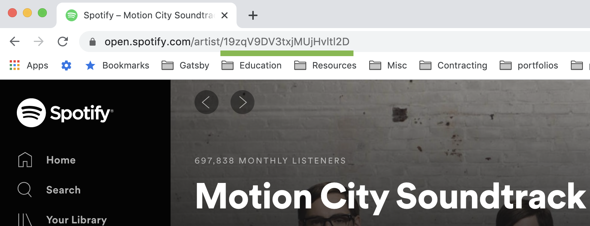

While testing, you'll hear a fair amount of their music, so pick something good!

With this ID in hand, let's add it to our main `App` component, and import our React Router friends:

```diff
import React from 'react';
import {
  BrowserRouter as Router,
+ Switch,
+ Route,
+ Redirect,
} from 'react-router-dom';

import GlobalStyles from '../GlobalStyles';

+const DEFAULT_ARTIST_ID = '2CIMQHirSU0MQqyYHq0eOx';

const App = () => {
  return <Router>TODO</Router>;
};

export default App;
```

Use the React Router documentation, as well as previous workshops, to create a route for `/artists/:id`, and a `<Redirect>` that otherwise sends users to `/artists/${DEFAULT_ARTIST_ID}`.

Create a new component, `ArtistRoute`, which will be rendered when the artist path matches.

> To make life a bit easier, you can use the terminal command `yarn nc ComponentName`. For example, in this case, you can run `yarn nc ArtistRoute`. It will create the correct component structure for you.
>
> `nc` stands for "New Component". This functionality comes from an NPM package called `new-component` (https://www.npmjs.com/package/new-component).

## Exercise 4: Managing the access token

Our first order of business: as soon as possible, we want to hit our backend server to get a Spotify access token, so that we can request data from spotify directly.

We'll do this in `App.js`, since that's our top-level component.

How do we do something in React immediately after the first render? We can use `React.useEffect`.

Inside the useEffect hook, make a `fetch` call to `/spotify_access_token`. When you have the response as JSON, start by logging it out. We can also catch any errors, and log them with console.error.

Take a few minutes to see if you can get this working. You should see a console message that looks like `{ access_token: 'fjdufhsd89fhdsfhs' }`. We'll add the Redux bits next, but you should use previous workshops to solve this first part.

> If you're getting an error, `SyntaxError: Unexpected token < in JSON at position 0`, it's likely because you need to add a "proxy" field to your package.json. Scroll back up to the "Setup" section and add that.

.
..
...
....
.....
......
.......
........
.......
......
.....
....
...
..
.
..
...
....
.....
......
.......
........
.......
......
.....
....
...
..
.
..
...
....
.....
......
.......
........

Here's our starting point, without Redux:

```js
// Inside App.js
React.useEffect(() => {
  fetch('/spotify_access_token')
    .then((res) => res.json())
    .then((json) => {
      console.log(json);
    })
    .catch((err) => {
      console.error(err);
    });
}, []);
```

We have three states we care about:

- The request is made, but we don't yet have the token (it's loading)
- The request is successful, and we have a token
- The request failed

Let's create Redux action-creators for each one. Add the following lines to `src/actions.js`

```js
export const requestAccessToken = () => ({
  type: 'REQUEST_ACCESS_TOKEN',
});

export const receiveAccessToken = (token) => ({
  type: 'RECEIVE_ACCESS_TOKEN',
  token,
});

export const receiveAccessTokenError = () => ({
  type: 'RECEIVE_ACCESS_TOKEN_ERROR',
});
```

Import those actions into App.js, and let's dispatch them at the right time:

```diff
React.useEffect(() => {
+ dispatch(requestAccessToken());

  fetch('/spotify_access_token')
    .then(res => res.json())
    .then(json => {
-     console.log(json);
+     dispatch(receiveAccessToken(json.access_token));
    })
    .catch(err => {
      console.error(err);
+     dispatch(receiveAccessTokenError());
    });
}, []);
```

Let's update our auth.reducer to handle these actions:

```diff
export default function authReducer(state = initialState, action) {
  switch (action.type) {
+   case 'REQUEST_ACCESS_TOKEN': {
+     return {
+       ...state,
+       status: 'loading',
+     };
+   }

+   case 'RECEIVE_ACCESS_TOKEN': {
+     return {
+       ...state,
+       token: action.token,
+       status: 'idle',
+     };
+   }

+    case 'RECEIVE_ACCESS_TOKEN_ERROR': {
+     return {
+       ...state,
+       status: 'error',
+     };
+   }

    default: {
      return state;
    }
  }
}

```

Verify that the actions are being dispatched correctly in the Redux Devtools, and updating the state:

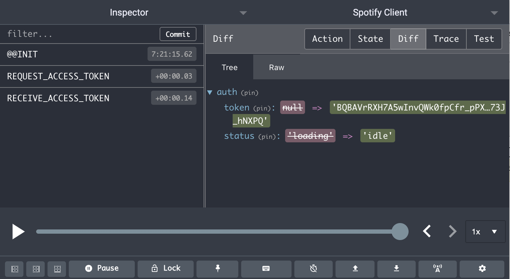

Notice that the `RECEIVE_ACCESS_TOKEN` action changes both the token from `null` to a random string, and the `status` from "loading" to "idle".

Cool! So our next goal is to select this token in our application. For now, we'll render it to verify that our Redux plumbing is correct.

Use the `useSelector` hook from the `react-redux` package to select it:

```js
// ArtistRoute.js
const ArtistRoute = () => {
  const accessToken = useSelector((state) => state.auth.token);

  return accessToken;
};
```

Here's what our beautiful page looks like:

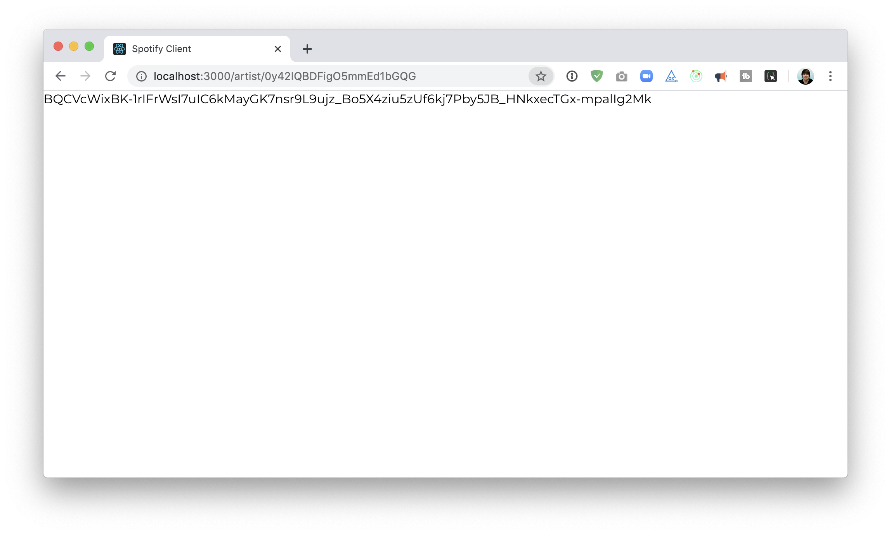

> _That was **a lot** of setup!!_
>
> The biggest complaint people have about redux is that there's "too much boilerplate". It takes a lot of work to set it up. It feels like it makes everything a bit slower.
>
> On a small application like this, it's probably not worth the trouble. But Redux shines on large, hairy applications. Many many companies use it because it actually _speeds up_ their development… but those speed gains are only noticeable when you have a medium or large codebase.

---

## Exercise 5: Artist profile

Let's use our shiny new access token to fetch information about the artist.

### Fetching the artist from Spotify

Create a new folder, `helpers`, in the `src` directory. Inside that new folder, create a new file, `api-helpers.js`.

We want this file because we may want to have _many_ different API calls to the Spotify API, and we should keep them all in the same place, for organization.

Create a new function that will fetch the artist profile from the API:

```js
export function fetchArtistProfile(token, artistId) {
  const options = {
    headers: { Authorization: `Bearer ${token}` },
  };

  const url = `https://api.spotify.com/v1/artists/${artistId}`;

  return fetch(url, options).then((response) => response.json());
}
```

This URL was found in the Spotify API documentation. We can see information about it here: https://developer.spotify.com/documentation/web-api/reference/artists/get-artist/

We're sending an `Authorization` header with our access token, and we're hitting the URL shown in the docs:

> GET https://api.spotify.com/v1/artists/{id}

Here is an example of the data returned from the API:

```json
{
  "external_urls": {
    "spotify": "https://open.spotify.com/artist/0OdUWJ0sBjDrqHygGUXeCF"
  },
  "followers": {
    "href": null,
    "total": 306565
  },
  "genres": ["indie folk", "indie pop"],
  "href": "https://api.spotify.com/v1/artists/0OdUWJ0sBjDrqHygGUXeCF",
  "id": "0OdUWJ0sBjDrqHygGUXeCF",
  "images": [
    {
      "height": 163,
      "url": "https://i.scdn.co/image/2efc93d7ee88435116093274980f04ebceb7b527",
      "width": 200
    },
    {
      "height": 52,
      "url": "https://i.scdn.co/image/4f25297750dfa4051195c36809a9049f6b841a23",
      "width": 64
    }
  ],
  "name": "Band of Horses",
  "popularity": 59,
  "type": "artist",
  "uri": "spotify:artist:0OdUWJ0sBjDrqHygGUXeCF"
}
```

We will want to make a request to this API in `ArtistRoute`. To make this request, we need two pieces of information: the Spotify access token, and the artist ID:

```js
// ArtistRoute.js
const ArtistRoute = () => {
  const accessToken = useSelector(state => state.auth.token);

  const artistId = ???

  fetchArtistProfile(accessToken, artistId)

  // render something
};
```

You'll need to get the `artistId` from the URL params. Check out the React Router Dom documentation to rediscover how to hook into and access the URL params.

**There's a "gotcha" here.** The very first time this component runs, you won't have `accessToken` - that data only becomes available after a few seconds, since it needs to fetch it from the API. So the very first time this component renders, you won't have the data you need.

Here's a similar case, and how to solve it:

```js
const SomeOtherApp = () => {
  const aDependentValue = useSelector(getDependantValue);
  const someOtherValue = 5;

  // Run an effect whenever `aDependentValue` changes.
  // ⚠️ Notice the "dependencies array" is [aDependentValue]
  React.useEffect(() => {
    // If we don't have that value, do nothing
    if (!aDependentValue) {
      return;
    }

    // If we make it here, we KNOW we have it!
    doSomethingWithDependentValue(aDependentValue, someOtherValue);
  }, [aDependentValue]);
};
```

### Managing data in Redux

Follow the same steps you did earlier for the auth token stuff:

- Create new actions in `src/actions.js` for the initial data fetch, the successful data response, and the error.
- Add a reducer to `src/artist-reducer.js`
- The initial state for `artist-reducer` should look like this:

```js
const initialState = {
  currentArtist: null,
  status: 'idle',
};
```

- When the info is first requested, the status should flip to `loading`
- When the data is successfully received, we should set `currentArtist` to be equal to this shape:

```js
state = {
  status: 'idle',
  currentArtist: {
    profile: {
      /* All the data we got from Spotify */
    },
  },
};
```

- When the data is not successfully received, set `status` to `error`.

### Updating the UI

Once the data is in your Redux store, use `useSelector` to fetch the `currentArtist`. The data you get from Spotify includes:

- Several images of the artist
- The artist's name
- The artist's number of followers
- An array of genres for the artist

Spend some time rendering this to the screen. Don't worry about styles yet, but do focus on good component structure / semantic HTML.

You will need to manipulate the data somewhat, in the following ways:

1. You only want to show the first 2 genres. The Spotify API might return many more.
2. We should show a "short version" for the # of followers. Instead of displaying "2451376 followers", we should say "2M followers". Instead of "12345" followers, "12K followers". Feel free to write a utility function for this, or search for a pre-existing solution online.

In the end, you should have something like this:

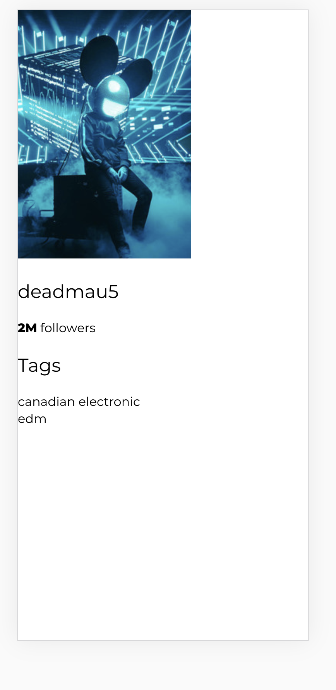

> Remember, the first time this renders, you won't have an artist yet! You can render a fallback, like the text "Loading...", until you have an artist you can use.

---

## Exercise 6: Design from Figma

The design for this application lives on Figma, a design tool (similar to Adobe Illustrator).

You can access the design here: https://www.figma.com/file/VAYO9Ezmxx4fMR29Sgylck/Spotify-App?node-id=0%3A1

Figma is a great tool for developers because it _gives you_ many of the details you would otherwise have to infer from a screenshot. For example, the side-panel gives you access to a set of "local styles":

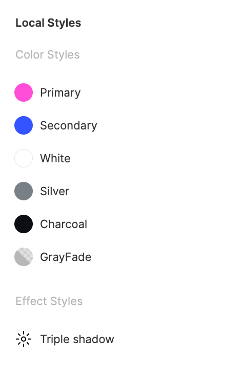

When you mouse over a color, a little "Settings" icon appears on the right. Click that icon, and it will give you the hex color code for that color:

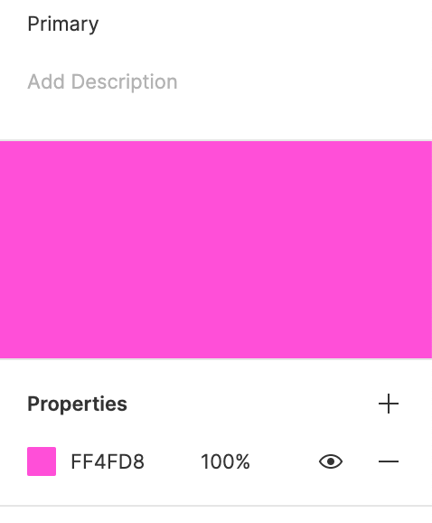

You can also click on individual elements to see their dimensions. If you hold `option` on Mac, `alt` on Windows, you'll be able to see the distances between adjacent elements. We can use this to determine our "margin":


Use the Figma design to style your artist profile. It should follow the design as closely as possible, and look something like this:

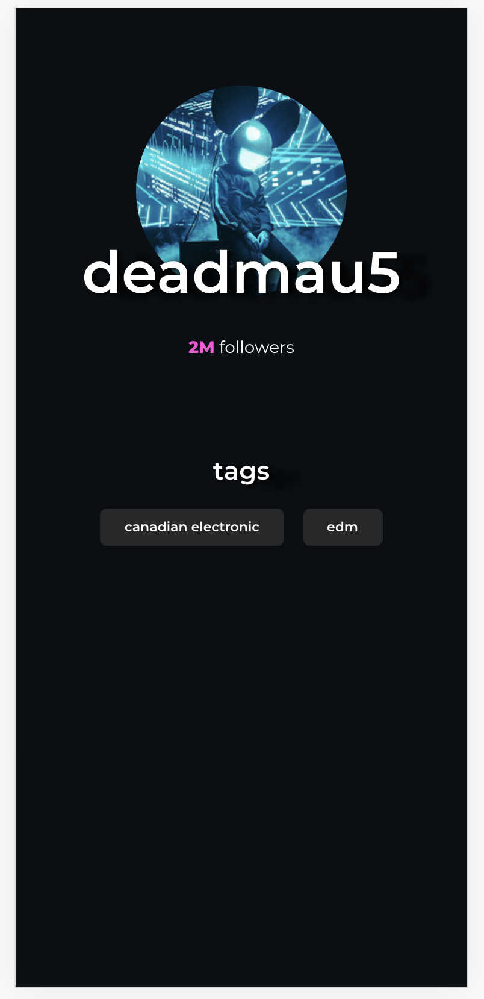

---

# Stretch Goals

This project has many stretch goals! If you find yourself with some time to spare, head on over to STRETCH.md and get started there =)
