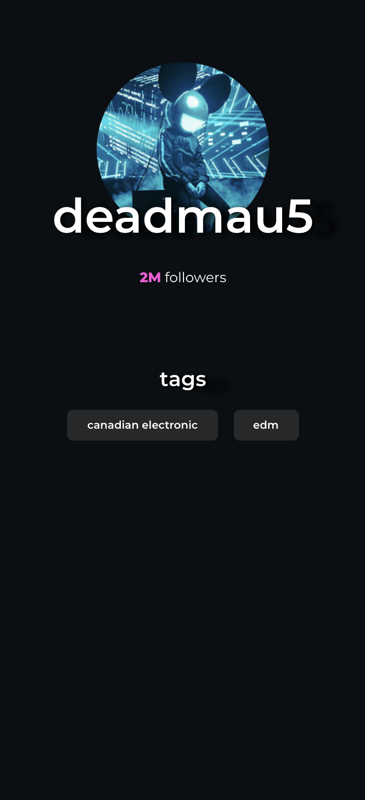

# Redux workshop - Spotify client

Today's workshop will see us build an application using _real data_ from the Spotify API.

Here is what the _final product_ will look like:

This is an application designed for _mobile browsers_. It loads data in real-time from the Spotify API, and stores this data in Redux.

This screenshot may not look like a lot of work, but getting everything set up can be quite challenging!

## Exercise 1: Working with APIs

Open this exercise file: [exercise-1.md](__workshop/exercise-1.md)

## Exercise 2: Understanding the initial state of the workshop

Open this exercise file: [exercise-2.md](__workshop/exercise-2.md)

## Exercise 3: Server setup

Open this exercise file: [exercise-3.md](__workshop/exercise-3.md)

## Exercise 4 - Frontend plumbing

Open this exercise file: [exercise-4.md](__workshop/exercise-4.md)

## Exercise 5: Routing

Open this exercise file: [exercise-5.md](__workshop/exercise-5.md)

## Exercise 6: Managing the access token

Open this exercise file: [exercise-6.md](__workshop/exercise-6.md)

## Exercise 7: Artist profile

Open this exercise file: [exercise-7.md](__workshop/exercise-7.md)

---

🟡 - Minimally complete workshop (75%) - 🟡

---

## Exercise 8: Design from Figma

Open this exercise file: [exercise-8.md](__workshop/exercise-8.md)

---

🟢 - Complete workshop (100%) - 🟢

---

## Stretch Goals

This project has many stretch goals! If you find yourself with some time to spare, head on over to [stretch-goals.md](__workshop/stretch-goals.md) and get started there =)

Here is the final product after all stretch goals have been completed:

