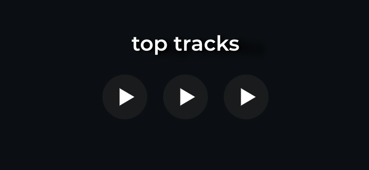
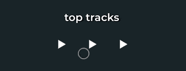
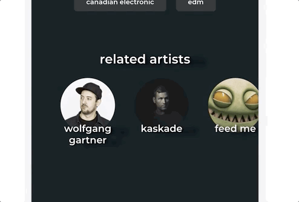
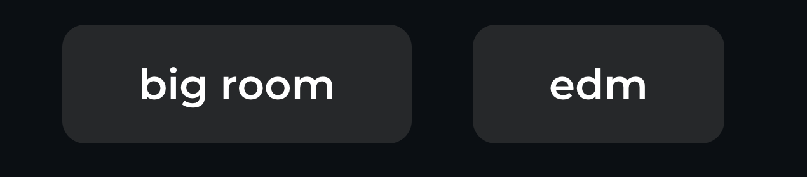
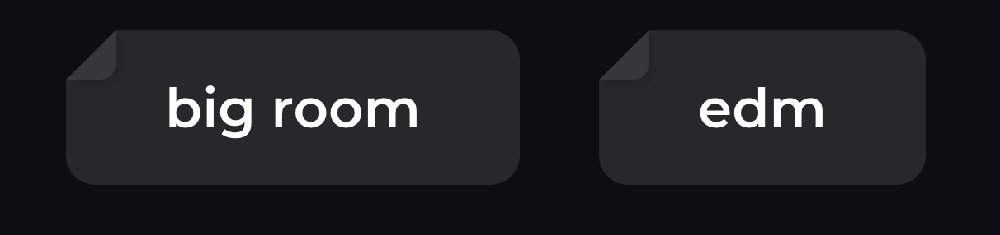

# Stretch goals

This workshop includes many stretch goals.

Here is the final product after all stretch goals have been completed:


## Stretch Goal 1: Top Tracks

Below the header, there are 3 play buttons for top tracks.



> **Critically, you are not expected to build the play buttons**. If you'd like, you can consider that a stretch-stretch goal, but you can use the NPM package `react-play-button` to accomplish this goal. You can learn more about that component and what props it accepts here: https://github.com/joshwcomeau/react-play-button. We'll outline it in depth below.

### Data fetching

Using the Spotify API, find the "Top Tracks" API endpoint. Create another helper in `api-helpers` to fetch the data from this endpoint. HINT: You need to specify a country in the query params. You can use US or CA.

Inside `ArtistRoute`, you have something like this:

```js
// ArtistRoute.js
const ArtistRoute = () => {
  const { artistId } = useParams();

  const accessToken = useSelector(state => state.auth.token);
  const artist = useSelector(state => state.artists.currentArtist);

  React.useEffect(() => {
    if (accessToken) {
      fetchArtistProfile(accessToken, artistId);
    }
  }, [accessToken]);

  if (!artist) {
    return 'Loading…';
  }

  return; /* Whatever your UI is */
};
```

This presents an interesting challenge; we now have 2 different API endpoints to hit, and we don't know which order they'll complete in. We want to wait for _all data to be available_ before we show the profile page / remove the "Loading…" message.

> You might think it's better to render each section ASAP, but in practice, it can be a very jarring experience when different parts of a page keep popping in at different times. Better in this case to wait for both endpoints

In the lecture, we covered using `Promise.all` to wait for the result of multiple promises. Let's restructure our actions a bit so we have the following actions:

**requestAllArtistInfo**

This action will be dispatched before any requests are made, to switch the `status` to `loading`

**receiveArtistProfile**

This action will be dispatched when the original `/artist/:artistId` data is received

**receiveTopTracks**

This action will be dispatched when the top tracks are received

**finishReceivingAllArtistInfo**

This action will be dispatched when _both_ of the endpoints have resolved, and all the data is ready. This will switch the status from `loading` to `idle`, and show the UI to the user.

**receiveArtistInfoError**

If either of the requests fail, we should dispatch an error, which will show the user an error message

_HINT:_ You can assign promises to a variable, to use them with `Promise.all`. Eg. `const firstPromise = fetch(/* stuff */)`

### Rendering a Play button

First, the API might return multiple tracks. Let's limit it to the first 3.

For each one, render something like this:

```js
import PlayButton from 'react-play-button';

<PlayButton
  url={track.preview_url}
  playIconColor={/* Find the value in Figma */}
  stopIconColor={/* Find the value in Figma */}
  idleBackgroundColor={/* Find the value in Figma */}
  progressCircleColor={/* Find the value in Figma */}
  progressCircleWidth={/* Find the value in Figma */}
/>;
```

You'll notice that it _doesn't work yet_. You need to tell the button whether it should be playing or not!

Think of it this way: when I click to play the first button, and then I click to play the second one, the first one should automatically stop. I don't want both buttons to play simultaneously:



`PlayButton` gives you three properties you'll need to use:

- `active`
- `play`
- `stop`

You'll want to keep something in React state which keeps track of _which_ track is currently playing, if any. You can then pass a boolean to `active` (so if the first track is playing, the first button would get `true`, the other two would get `false`). You can use the `play` and `stop` buttons to set the state in response to user actions (so if the user clicks the "stop" button, it will call the `stop` function, which you can use to set state).

---

## Stretch goal 2: Loading screen

Instead of showing the text "loading…" while waiting for all the Spotify requests to resolve, let's do something more exciting and on-brand.


This spinner is from the NPM package `react-loader-spinner`. Look it up, and use its documentation to add it. You can also create a component, `FullScreenSpinner`, that uses this package and also manages the position (full-screen with a centered spinner, like in the GIF)

---

## Stretch goal 3: related artists

There is one more bit in the UI: a list of related artists:



There is a Spotify API endpoint to fetch this information. Your goal is to find it and use it. Add a new Redux action, follow the same pattern.

As in the GIF, this section should show _all_ of the available related artists, but this area should be horizontally scrollable. _HINT:_ the `overflow` CSS property might come in handy.

Additionally, these artists should be React Router `Link`s. When you click one, it should take you to that artist's page. In that way, you can continue to discover new music by following a chain of related artists.

---

## Stretch goal 4: Fancy tags

In the original version of this workshop, the tags use border-radius and a background color:



We can spruce this up a bit, do something a little bit fancy. Let's fold the top-left corner downwards:



Your challenge is to figure out how this can be done, with some CSS. For bonus points, no HTML changes should be required.

_HINT:_ So there is no "folding" ability in CSS. We're faking this.

_HINT:_ You can use the `clip-path` CSS property to "trim off" certain sections. `clip-path` lets you draw a polygon, and everything outside that polygon will be made invisible. https://developer.mozilla.org/en-US/docs/Web/CSS/clip-path

_HINT:_ Every element can be given a "before" and "after" pseudo-element. A pseudo-element lets you render an additional "box". You might want to use a `:before` for the "flap" in the top left. https://developer.mozilla.org/en-US/docs/Web/CSS/::before
