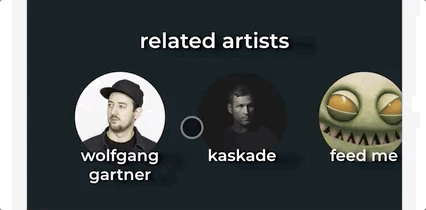

# Stretch goal 3: related artists

There is one more bit in the UI: a list of related artists:

There is a Spotify API endpoint to fetch this information. Your goal is to find it and use it. Add a new Redux action, follow the same pattern.

As in the GIF, this section should show _all_ of the available related artists, but this area should be horizontally scrollable. _HINT:_ the `overflow` CSS property might come in handy.

Additionally, these artists should be React Router `Link`s. When you click one, it should take you to that artist's page. In that way, you can continue to discover new music by following a chain of related artists.

---

## Stretch goal 3.1: Scroll snapping

By default, the related artists section will be "loose":

It is possible in CSS to use "scroll snapping", so that it aligns items within the container when scrolling:

It can be hard to tell in the GIF, but whenever I stop scrolling with the mouse, it locks to the nearest artist. It never lets an artist get cut in half by the left edge of the screen. This provides a nice little boost to user experience.

In the past, complicated Javascript-based solutions would have been required to achieve this effect. Now it can be done in 3 lines of CSS.

Research "CSS scroll snapping". `scroll-snap-type` is a good place to start.
